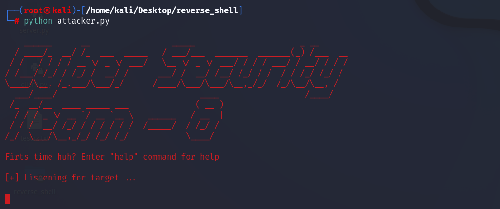
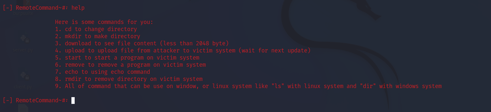

# Remote access trojan thực hiện bởi Team 8

- Dưới đây là một vài hình ảnh đầu tiên của reverse shell đã được thực hiện

    

    
- Thực thi lệnh `dir` trên máy nạn nhân
    
- Thực thi lệnh `help` để xem câu lệnh hỗ trợ

- Và chương trình có thể thực hiện rất nhiều câu lệnh khác trên `windows` hoặc ngay cả `linux` và trên bất kỳ hệ thống nào mà nó xâm nhập được

# Cách cài đặt

        pip install socket

- Sau khi cài đặt package socket thì ta sẽ clone 2 file `attacker` và `victim.py` về máy bằng câu lệnh

```
    git clone https://github.com/quangdaik2362001/remote_access_trojan.git
```

- Trước khi khởi chạy sẽ cần mở source code lên để config lại cái `attacker_ip` thành địa chỉ IP máy mình, và cùng với đó là `listener_ip` thành IP máy mình giống như `attacker_IP` rồi sau đó mới khởi chạy

- Trước khi khởi chạy file `victim.py` thì ta cần khởi chạy file `attacker.py` để lắng nghe kết nối trước 

- Sau khi clone về ta sẽ bằng cách nào đó execute file `victim.py` trên máy nạn nhân (sau này ta sẽ pack file python lại thành file thực thi stand alone để tiện gửi cho victim)

- Kết quả là ta có thể thực hiện remote command trên máy nạn nhân


**Tuy nhiên đây mới chỉ là bản demo ban đầu, chưa hoàn thiện đầy đủ tính năng**

# Các tính năng sắp tới sẽ update thêm

- Pack file `victime.py` thành file thực thi `.exe` để dễ dàng gửi cho nạn nhân  ✅

- Nâng cấp thêm lệnh thực thi `cd,...` ✅

- Nâng cấp thêm tính năng `keylogger` 📛

- Nâng cấp thêm tính năng `download/upload file` giữa máy nạn nhân và máy attacker ✅50% 

- Nâng cấp thêm tính năng `screenshot` trên máy nạn nhân 📛

- Bổ sung tính năng `auto run` và `auto connect to host` trên trojan ✅

- Bổ sung tính năng `nguỵ trang` ngay khi được khởi chạy trên máy nạn nhân  ✅

**Các tính năng khác mọi người cho ý tưởng và update thêm**
